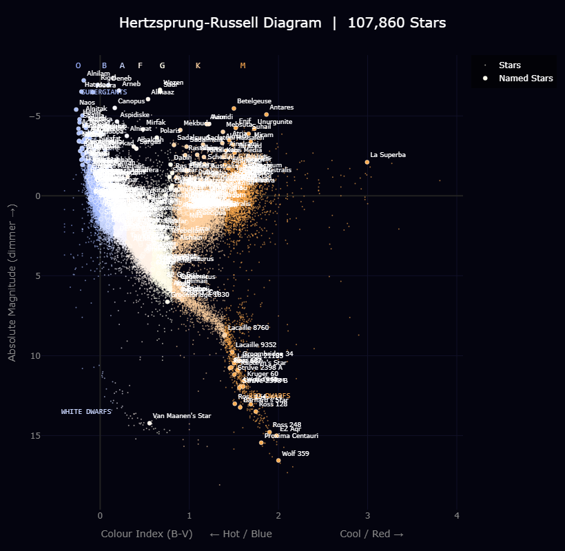

# Star Explorer

An interactive Hertzsprung-Russell diagram and stellar classification visualiser built from the HYG star catalog, containing 107,860 stars from the Hipparcos, Yale Bright Star, and Gliese catalogs.



## What is the Hertzsprung-Russell Diagram?

The Hertzsprung-Russell (HR) diagram is one of the most important tools in astronomy. It plots stars by two properties:

- **X axis: Colour Index (B-V)** — a measure of a star's temperature. Negative values (left) are hot blue stars. Positive values (right) are cool red stars.
- **Y axis: Absolute Magnitude** — a star's intrinsic brightness, independent of its distance from Earth. Brighter stars sit higher on the chart.

When you plot enough stars, distinct structures emerge that reveal the life cycle of stars:

| Region | Description |
|---|---|
| **Main Sequence** | The diagonal band running top-left to bottom-right. This is where stars spend most of their lives fusing hydrogen into helium. The Sun sits here. |
| **Red Giants** | Upper-right region. Stars that have exhausted their hydrogen and expanded enormously. Betelgeuse and Antares are examples. |
| **Supergiants** | Top of the diagram. Extremely luminous, massive stars with short lifespans. Rigel and Deneb sit here. |
| **White Dwarfs** | Lower-left. The dense, cooling remnants of dead stars. Van Maanen's Star is one of the nearest. |
| **Red Dwarfs** | Lower-right. Small, dim, cool stars. The most common type in the galaxy. Proxima Centauri and Wolf 359 are examples. |

## Spectral Classification

Stars are classified by spectral type based on their surface temperature:

| Class | Colour | Temperature | Example |
|---|---|---|---|
| O | Blue | > 30,000 K | Naos |
| B | Blue-white | 10,000-30,000 K | Rigel |
| A | White | 7,500-10,000 K | Sirius |
| F | Yellow-white | 6,000-7,500 K | Procyon |
| G | Yellow | 5,200-6,000 K | The Sun |
| K | Orange | 3,700-5,200 K | Arcturus |
| M | Red | < 3,700 K | Betelgeuse |

A useful mnemonic: **O**h **B**e **A** **F**ine **G**uy/**G**irl, **K**iss **M**e.

## Data Source

The [HYG Database](https://www.astronexus.com/projects/hyg) (v3.7) is a compilation of stellar data from three catalogs:

- **H**ipparcos Catalog: High-accuracy positional and parallax data for ~118,000 stars
- **Y**ale Bright Star Catalog: Data on all naked-eye stars including traditional names and Bayer designations
- **G**liese Catalog of Nearby Stars: Comprehensive catalog of stars within 75 light years of the Sun

Licensed under [CC BY-SA 2.5](https://creativecommons.org/licenses/by-sa/2.5/).

## Getting Started

### Requirements

```bash
pip install pandas numpy plotly requests jupyter
```

Or install from the requirements file:

```bash
pip install -r requirements.txt
```

### Download the Data

The data file is not included in this repo due to size. Download it by running the first cell in the notebook, or manually:

```python
import urllib.request
urllib.request.urlretrieve(
    'https://www.astronexus.com/downloads/catalogs/hygdata_v37.csv.gz',
    'hygdata_v37.csv.gz'
)
```

### Run the Notebook

```bash
jupyter notebook star_explorer.ipynb
```

Or open directly in VS Code with the Jupyter extension installed.

## Visuals

The notebook produces two interactive Plotly figures:

1. **Basic HR Diagram** — 50,000 stars sampled from the full catalog, coloured by B-V colour index, with named stars labelled
2. **Annotated HR Diagram** — Same diagram with region labels (Main Sequence, Red Giants, Supergiants, White Dwarfs, Red Dwarfs) and spectral class markers along the top axis

Both figures are exported as standalone HTML files that can be opened in any browser without any dependencies.

## Key Findings

- The main sequence is clearly visible as a diagonal band containing the vast majority of stars
- K and F type stars dominate the catalog (28,845 and 24,594 respectively), reflecting the Hipparcos survey's coverage
- The Sun (G2V, absolute magnitude 4.85, colour index 0.656) sits exactly where stellar physics predicts on the main sequence
- White dwarfs form a distinct lower-left cluster, with Van Maanen's Star as one of the most isolated examples
- Red supergiants like Betelgeuse (M2Iab) and Antares (M1.5Iab) sit dramatically above and to the right of the main sequence

## Tools

- **Python** with pandas, numpy, plotly
- **Data**: HYG v3.7 stellar catalog
- **Environment**: Jupyter Notebook / VS Code

## Author

James Turek — [jamesturek.github.io](https://jamesturek.github.io)

MSc Geographic Data Science, London School of Economics
